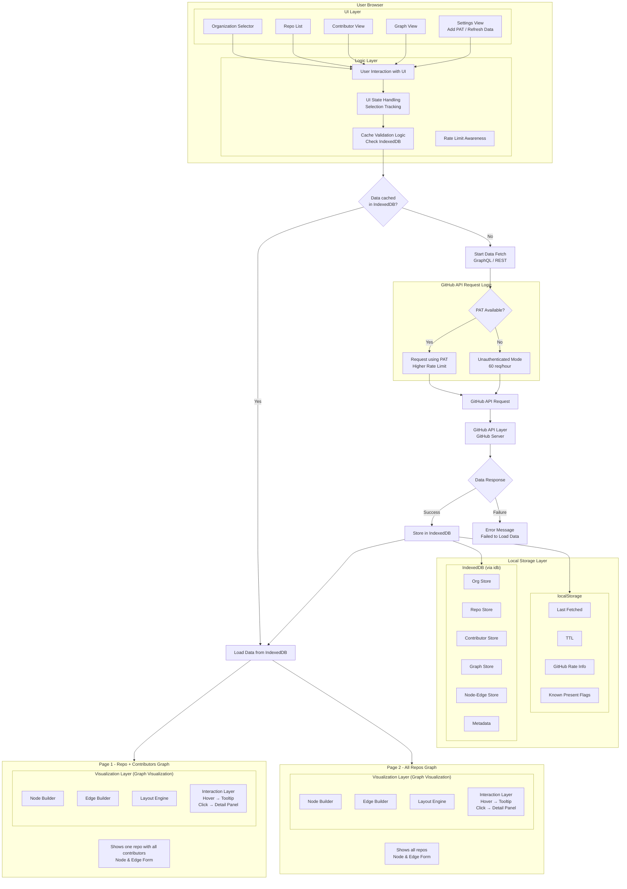

<!-- Don't delete it -->
<div name="readme-top"></div>

<!-- Organization Logo -->
<div align="center" style="display: flex; align-items: center; justify-content: center; gap: 16px;">
  
  
</div>

<div align="center" style="margin-top: 16px; margin-bottom: 16px;">


<a href="https://x.com/aossie_org">
</a>
&nbsp;&nbsp;
<a href="https://discord.gg/hjUhu33uAn">
</a>
&nbsp;&nbsp;
<a href="https://www.linkedin.com/company/aossie/">
  </a>
&nbsp;&nbsp;
<a href="https://www.youtube.com/@StabilityNexus">
  </a>
  &nbsp;&nbsp;

[](LICENSE)

</div>

---

**OrgExplorer** transforms GitHub organizations into interactive, visual intelligence dashboards. Explore repository relationships, compare two or more organizations, contributor networks, activity trends, risk metrics, and organizational health—all without leaving your browser.

### Key Insights

- Organizational structure and repository relationships
- Comparative analysis of multiple organizations
- Repository relationship mapping
- Contributor collaboration networks
- Activity trends and growth patterns
- Bus factor & single-point-of-failure detection
- Technology stack distribution
- Real-time organizational metrics

---

## 🚀 Features

- **Fully Browser-Based** — Runs entirely in the browser using GitHub APIs with no backend server required.

- **Organization Overview Dashboard** — Explore repositories, contributors, activity trends, tech stack distribution, and organization growth insights.

- **Advanced Repository Analytics** — Analyze repository activity, contributor density, issue and PR trends, health metrics, and lifecycle status.

- **Contributor & Repository Network Graphs** — Interactive visualizations for contributor collaboration and repository-centric contributor relationships.

- **Multi-Organization Analysis** — Compare and analyze multiple GitHub organizations together.

- **Repository Health & Governance Insights** — Detect inactive repositories, stale issues/PRs, missing licenses, and contributor concentration risks.

- **Time-Series Activity Charts** — Visualize weekly and monthly repository, issue, and pull request activity trends.

- **Persistent API Cache & Performance Optimization** — IndexedDB-powered caching and optimized handling for large organizations and datasets.

- **Personal Access Token (PAT) & API Quota Support** — Optional authenticated mode with rate limit awareness and enhanced API access.

- **Advanced Repository Explorer** — Interactive repository table with filtering, sorting, and computed analytics metrics.

- **Export & Share Features** — Export analytics reports and share application state through URL-based deep linking.

---

## 💻 Tech Stack

**Frontend**: React 18 · JavaScript · TailwindCSS · Vite  
**Visualizations**: D3.js · Recharts  
**Data**: GitHub REST & GraphQL APIs  
**Storage**: IndexedDB (browser-based caching), Local Storage (user settings)  
**Build**: Vite with React plugin

---

## ✅ Project Checklist

- [x] Organization overview dashboard implemented  
- [x] Repository-level analytics implemented  
- [x] Contributor graph visualization system built  
- [x] Advanced GraphQL authenticated mode  
- [x] Enterprise-grade caching and rate optimization  
- [x] Historical data tracking engine  

---

## 🔗 Repository Links

1. [Main Repository](https://github.com/AOSSIE-Org/OrgExplorer)

---

## 🏗️ Architecture Diagram



### System Structure

- Frontend (React + D3.js + Recharts)
- Data Processing Layer (analytics engine)
- GitHub REST API
- Optional GitHub GraphQL API
- Database (IndexedDB for caching, local storage for user settings)
- UI Rendering Layer (dashboard, graphs, panels)

Data flows:

User → Frontend → API → GitHub APIs → Processing Layer → Database → UI Rendering

---

## 🔄 User Flow

```
User enters organization name
        ↓
REST API fetches public insights for organization
        ↓
Analytics engine computes metrics
        ↓
Dashboard renders visual intelligence
        ↓
(Optional) User enables advanced authenticated mode
```

### Key User Journeys

1. **Clone & Install**

   ```bash
   git clone https://github.com/AOSSIE-Org/OrgExplorer.git
   cd OrgExplorer
   npm install
   ```

2. **Run Development Server**

   ```bash
   npm run dev
   ```

   Open http://localhost:5173 in your browser.

3. **Risk Assessment**
   - Open bus factor panel
   - Detect low contributor redundancy
   - Review critical repositories

---

## 🍀 Getting Started

We welcome contributions from developers, designers, and open-source enthusiasts. See [CONTRIBUTING.md](./CONTRIBUTING.md) for:

- How to report bugs and suggest features
- Development workflow and coding standards
- Pull request guidelines
- Community communication

## 📍 License

This project is licensed under the GNU General Public License v3.0.  
See the [LICENSE](LICENSE) file for details.

---

## 💪 Thanks To All Contributors

Open source grows because of people like you.

© 2026 AOSSIE. All rights reserved.

---

Thanks a lot for spending your time helping OrgExplorer grow. Keep rocking 🥂

<a href="https://github.com/AOSSIE-Org/OrgExplorer/graphs/contributors">
  
</a>
<br>
